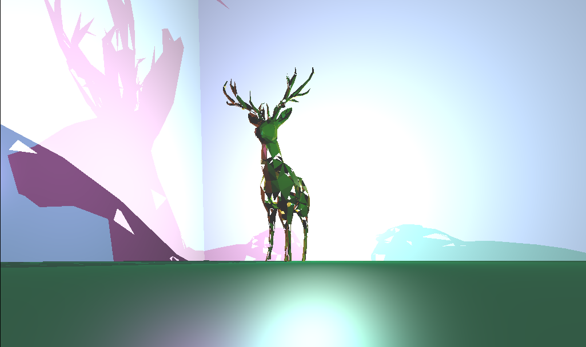
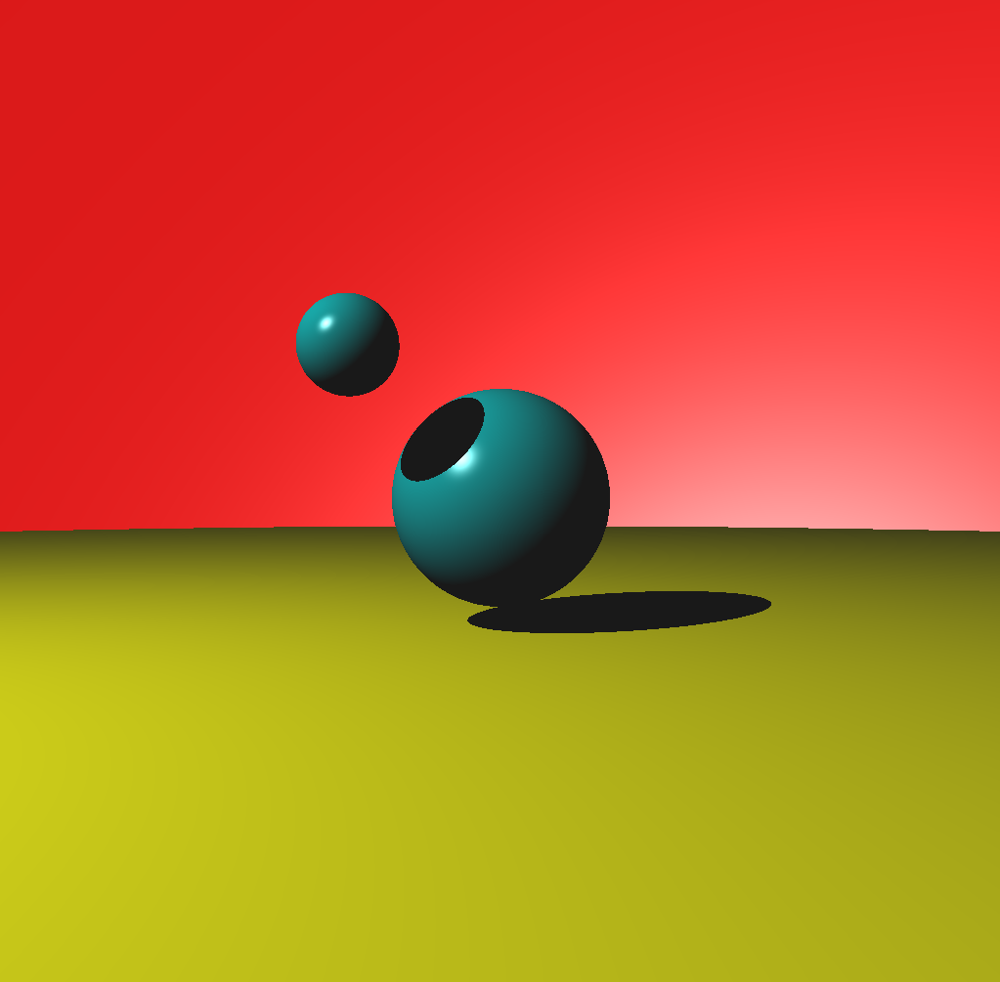
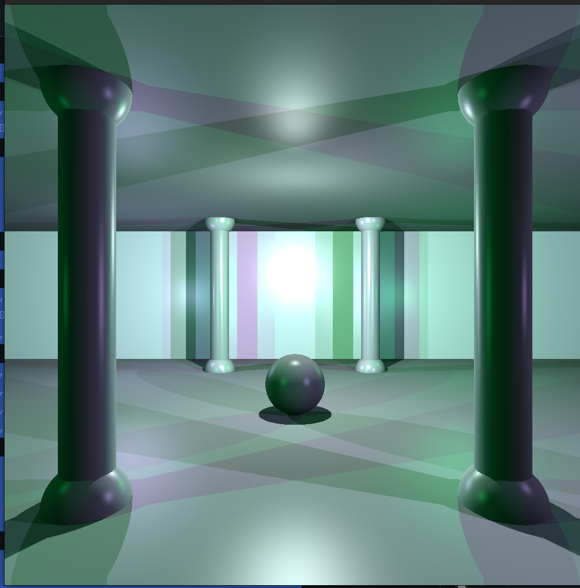

## MINIRT✨



<div>






</div>
⚠ 2枚目 bug

```sh
make run
make log # debug
make val # memory check
make norm
make func
```

### WIKI

- [Home](https://github.com/QWERTOP18/MINIRT/wiki/)
- [ClassDiagram](https://github.com/QWERTOP18/MINIRT/wiki/ClassDiagram)
- [Vector](https://github.com/QWERTOP18/MINIRT/wiki/Vector)
- [Flow](https://github.com/QWERTOP18/MINIRT/wiki/Flow)
- [Parse](https://github.com/QWERTOP18/MINIRT/wiki/Parse)
- [log](https://github.com/QWERTOP18/MINIRT/wiki/log)

### directory 階層

```py
.
├── DOCS
├── console # logのフォーマッタなど
├── debug
├── incs
├── input # rt file置き場
├── libft
├── list
├── minilibx
├── vector
├── srcs
│ ├── interface # mlxとのinterface
│ ├── intersection
│ ├── object # camera, light, materialなど
│ ├── parse
│ ├── system.c
│ ├── raytrace.c # raytraceのエントリーポイント
│ ├── calculate.c # RGBの計算
│ └── main.c
```

### Utilis

- **[libc](https://github.com/QWERTOP18/LIBFT)** – My custom C standard library implementation
- **[list](https://github.com/QWERTOP18/LINKED-LIST)** – My custom Linked list utilities
- **[vector](https://github.com/QWERTOP18/C_VECTOR)** – Simple 3D vector math library

### Libraries

- **[minilibx](https://harm-smits.github.io/42docs/libs/minilibx/introduction.html)** – Lightweight graphics library used in 42 projects

### ヘッダーファイル

| ヘッダーファイル     | 役割                                       |
| -------------------- | ------------------------------------------ |
| **`camera.h`**       | カメラのリストを管理する                   |
| **`color.h`**        | RGB は vec3 で管理                         |
| **`intersection.h`** | 光線とオブジェクトの衝突計算               |
| **`light.h`**        | 光源のリストを管理する                     |
| **`material.h`**     | 物体の材質、texture など                   |
| **`minirt.h`**       | プロジェクト全体のメインヘッダー           |
| **`object.h`**       | オブジェクトのリストを管理する             |
| **`parse.h`**        | シーンのデータ（ファイルや入力情報）の解析 |
| **`raytrace.h`**     | レイトレーシングのメイン処理               |
| **`screen.h`**       | 画像の出力やピクセル単位の描画処理         |
| **`system.h`**       | システム関連の処理（メモリ管理など）       |

### input.rt

https://github.com/arashi0-git/RTfiles.git

```rt
A  0.1      255,255,255             # Ambient
C  0,3,-20    0,-0.2,1    60        # main camera
c  20,3,0    -1,0,0       60        # sub camera
c  -20,3,0    1,0,0       60
c  0,20,0    0,-1,0       60
L  15,15,-15  0.9  255,255,255      # main  light
l  -15,15,-15 0.3      0,0,255      # sub light
pl 0,-4,0   0,1,0    255,255,0      # plane
sp 5,0,0       3       255,0,0      # sphere
cy -5,-1,0   0,1,0   4  2 0,255,0   # cylinder
sq 0,-2,-3   1,1,-1  3  0,176,176   # square
```
